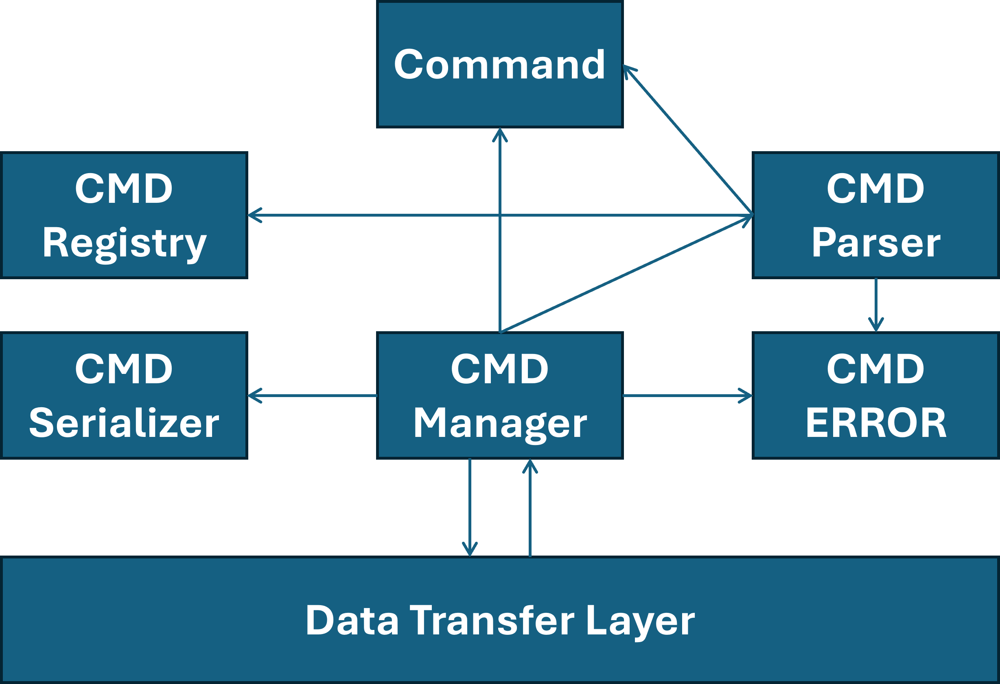
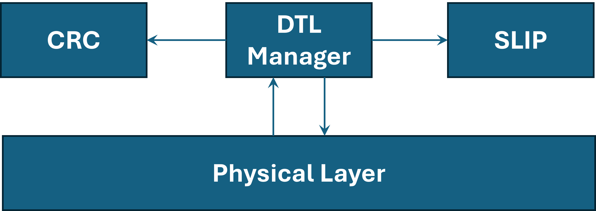

# STBee Serial Protocol

# Table of Contents

# 1. Introduction

## 1.1 Overview
This protocol depends on Command-Response-Acknowledgment `(CRA)` messages and is designed to handle multiple requests at same time.

CRA messages are binary encoded to reduce the overhead of using strings.

There are two types of messages: error-checked messages and non error checked messages introduced in DTL section.

# 2. Command Layer Communication
## 2.1 CRA Frame
In this protocol standard there is three types of messages.

- Command Message: always sent from the client to request some action.

- Response Message: always sent from server after processing a request from client. Response is considered acknowledgment.

- Acknowledge Message: always sent from the client after processing to tell the server that response has arrived and processed correctly, so it can close the CRA call and discard response if needed.

## 2.2 Command Format
The following figure outlines the command format which is used for communication purposes. 

### 2.2.1 Unique Identifier
This field contains a unique 8-bit integer used to identify each CRA session in order to allow handling multiple requests at same time and this allows handling up to 256 request at same time.

### 2.2.2 Reserved
This field contains 4-bits that are reserved for future uses and can be used as flags if needed.

### 2.2.3 Acknowledge Flag (AF)
This flag is used to distinguish between commands and acknowledge frames. It's set to zero if command and one otherwise.

### 2.2.4 Device or Network (DEV/NWK)
This flag is used to distinguish between device and network commands.
Zero for device commands and one otherwise.

### 2.2.5 Priority
Contains two bits to support four levels of priority. Server should handle higher priority commands before lower ones.

### 2.2.6 Command
This field contains 8 bits to support up to 256 commands.

### 2.2.7 Payload
This field contains any parameters sent by application layer and has maximum size of 300 bytes.

# 2.3 Response Format
The following figure outlines the response format which is used for communication purposes. 

### 2.3.1 Unique Identifier
This field contains a unique 8-bit integer used to identify each CRA session in order to allow handling multiple requests at same time and this allows handling up to 256 request at same time.

It's generated by client.

### 2.3.2 Status
This field contains the status of response to support easy debugging and error handling.

### 2.3.3 Response
This field contains the response to the command sent.

## 2.4 Diagrams

## 2.5 Entities

`حط الصور يااااااااااض يا أبو حياة`

# 3. Data Transfer Layer (DTL)

This layer provides two ways of sending messages: error-checked messages and non error checked messages.

In error-checked messages 16-bits FCS are added as footer.
On error found the error is reported to upper layer to be handled.

Slip encoding is performed as a last stage to wrap the packet and determine its length.

## 3.1 DTL Packet Format
The following figure outlines the dtl packet format.

### 3.1.1 CRC Enable (CRC EN)
On set to one then a 16-bit CRC is generated and attached to the packet footer, otherwise no CRC is generated.

### 3.1.2 Reserved
7 bits reserved for future use.

### 3.1.3 Payload
Contains the payload of the upper layer.

### 3.1.4 CRC 16
Optional 16-bits for CRC calculation.

### 3.1.5 SLIP Wrapper
This is used to wrap the packet before sending it to physical layer, this is important to determine the begin and end of the packet.

## 3.2 Entities

# 4. Physical Layer
This layer is responsible for sending packets over the physical wire using UART communication protocol.

Specifications:
- Baud Rate: 115200 bps
- One Stop Bit
- No Parity
- Data Bits: 8 bits
- Flow Control: RTS/CTS (if board doesn't support then use XON/XOFF)

# 5. Services
## 5.1 Network Services
### 5.1.1 Network Capture
This command should force the server to hold a capture of nodes and links.

Command Message
| Field | Content | Description |
| :----  | :------- | :----------- |
| AF | COMMAND_FRAME | Set frame as command frame |
| Command | NWK_CAPTURE | Network Capture Request |

Response Message
| Field | Content | Description |
| :----  | :------- | :----------- |
| Status | Status byte | see appendix |
| Response[0] | Capture Status | 0x00: START Capture   Else this indicates a problem |

### 5.1.2 Node Discovery
This command is used to discover a new node in the captured network, if all nodes are discovered then it returns `END_OF_CAPTURED_NODES`.

Command Message
| Field | Content | Description |
| :----  | :------- | :----------- |
| AF | COMMAND_FRAME | Set frame as command frame |
| Command | NWK_DISCOVER | Network Discovery Request |

Response Message

| Field | Content | Description |
| :----  | :------- | :----------- |
| Status | Status byte | see appendix |
| Response[0..1] | Network Address of Node or `END_OF_CAPTURED_NODES` | 16-bit integer |
| Response[2..11] | MAC Address of Node | 64-bit integer |
| Response[12] | Logical Type of Node | 0x00: Coordinator   0x01: Router   0x02: End Device |
| Response[13..14] | Parent Network Address of Node | 16-bit integer |

### 5.1.3 Link Query

Command Message
| Field | Content | Description |
| :----  | :------- | :----------- |
| AF | COMMAND_FRAME | Set frame as command frame |
| Command | LINK_DISCOVER | Link Discovery Request |

Response Message

| Field | Content | Description |
| :----  | :------- | :----------- |
| Status | Status byte | see appendix |
| Response[0..1] | Network Address of First Node or `END_OF_CAPTURED_LINKS` | 16-bit integer |
| Response[2..3] | Network Address of Second Node | 16-bit integer |
| Response[4] | Income Cost of Link | Ranges from 0 to 7 |
| Response[5] | Outcome Cost of Link | Ranges from 0 to 7 |

